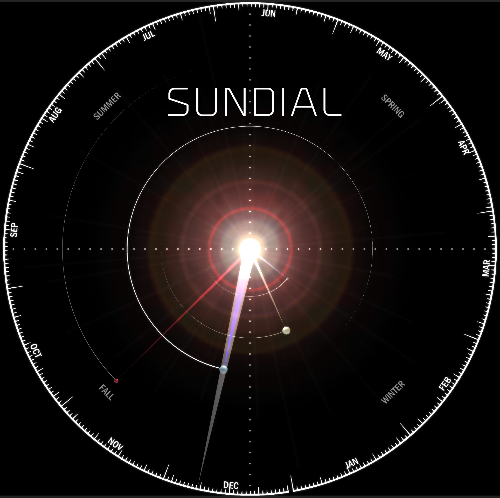
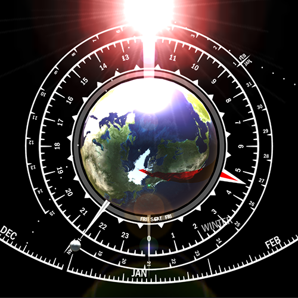

#SUNDIAL  
An astronomical clock that shows the position of the Earth and inner planets from an overhead view. A second view state shows a 24 hour clock around the Earth.  

  
  

Published here for Google Play:  
https://play.google.com/store/apps/details?id=com.PrimeSoftwareSystems.Sundial  

Calendar jar must be built with the same version of android as the unity player android version  
Plugin is based on this code:  
https://github.com/spotsoftware/android-calendar-sample  

classes.jar must be included as CompileOnly path to:  
C:\Program Files\Unity\Hub\Editor\2023.2.18f1\Editor\Data\PlaybackEngines\AndroidPlayer\Variations\il2cpp\Release\Classes\classes.jar  

replacing other path in AndroidStudio  

c087edff1e5d46bf5444158b3a91ffd7c1e46169  